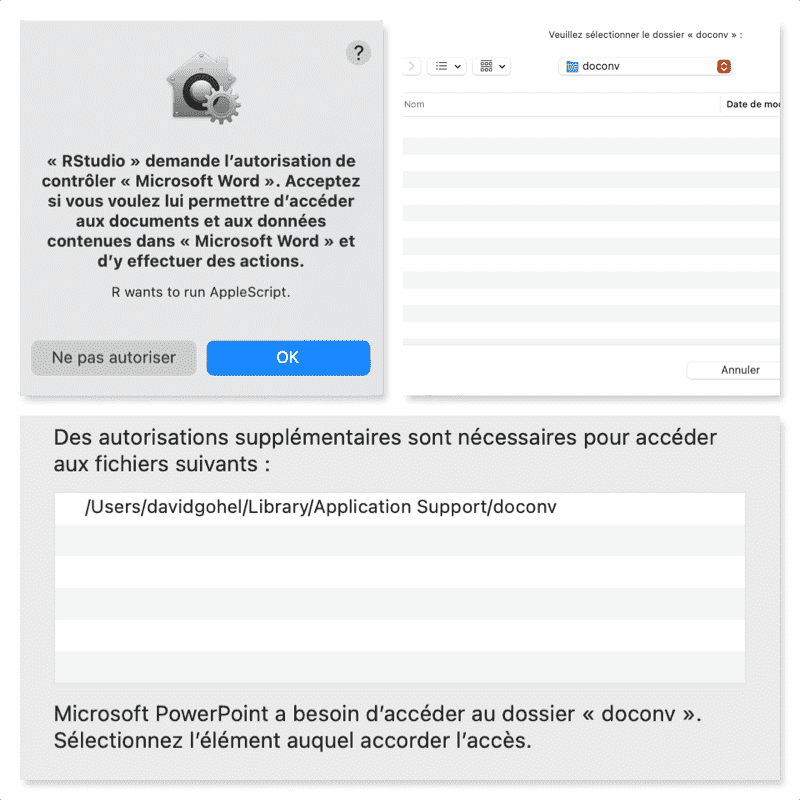

<!-- README.md is generated from README.Rmd. Please edit that file -->

```{r, include = FALSE}
knitr::opts_chunk$set(
  collapse = TRUE,
  comment = "#>",
  fig.path = "man/figures/README-",
  out.width = "100%"
)
library(doconv)
```

# doconv

 The package provides functions for converting 'Microsoft Word' or
'Microsoft PowerPoint' documents to 'PDF' format and also for converting
them to images in the form of thumbnails. A function is also provided to
update all fields and tables of contents of a Word document.

The package uses 'Microsoft Word' or 'Microsoft PowerPoint' when available;
otherwise 'LibreOffice' can be used as a fallback.

Visual-testing functions for documents are also provided.
Formats 'doc', 'docx', 'ppt', 'pptx', 'html', 'pdf' and 'png' are supported. The
functions can be used with packages 'testthat' and 'tinytest'.

**Important:** For faithful rendering, this package requires 'Microsoft Word'
and 'Microsoft PowerPoint', which are only available on **Windows** and **macOS**.
'LibreOffice' works on all platforms (including Linux) but its rendering of
Office documents is often inaccurate (misplaced content, wrong fonts, broken
layouts). Because 'Microsoft Office' is licensed desktop software, this package
is best suited for **interactive use** rather than CI/CD pipelines or server
deployments.

<!-- badges: start -->
[](https://github.com/ardata-fr/doconv/actions)
<!-- badges: end -->

## Installation

You can install the latest version from GitHub with:

``` r
# install.packages("devtools")
devtools::install_github("ardata-fr/doconv")
```

## Setup

The package requires 'Microsoft Word' and 'Microsoft PowerPoint'.
If they cannot be installed, 'LibreOffice' can be used instead; please visit
<https://www.libreoffice.org/> and follow the installation instructions.

Use function `check_libreoffice_export()` to check that 'LibreOffice'
is installed and can export to PDF:

```{r}
check_libreoffice_export()
```

When 'Microsoft Word' or 'Microsoft PowerPoint' are available,
the output looks exactly like the original document.
With 'LibreOffice', be aware that the rendering may differ
(sections can be misinterpreted, for example).

### Authorization on macOS

If you are running R on macOS, you have to authorize a few things before
starting.

PDF processing takes place in a working directory managed with
function `working_directory()`. 'Word' and 'PowerPoint' must be
authorized to write to this directory. These permissions must be set
manually as required by the macOS security policy.

You must click a few buttons:

1. Allow R to run 'AppleScript' scripts that will control Word.
2. Allow Word to write to the working directory.



These are one-time operations.

## Usage

```{r}
library(doconv)
```

### Generate thumbnails

`to_miniature()` converts a document to an image of thumbnails:

```{r}
docx_file <- system.file(package = "doconv", "doc-examples/example.docx")
to_miniature(
  filename = docx_file,
  row = c(1, 1, 2, 2))
```

### Convert to PDF

```{r}
pptx_file <- system.file(package = "doconv", "doc-examples/example.pptx")
to_pdf(pptx_file, output = "pptx_example.pdf")
to_miniature("pptx_example.pdf", width = 1000)
```

```{r}
to_pdf(docx_file, output = "docx_example.pdf")
to_miniature("docx_example.pdf", width = 1000)
```

```{r include=FALSE}
unlink(c("docx_example.pdf", "pptx_example.pdf"))
```

### Update Word fields and TOC

```{r eval=FALSE}
library(officer)
library(doconv)

read_docx() |>
  body_add_fpar(
    value = fpar(
      run_word_field("DOCPROPERTY \"coco\" \\* MERGEFORMAT"))) |>
  set_doc_properties(coco = "test") |>
  print(target = "output.docx") |>
  docx_update()
```

## Related work

* Package [docxtractr](https://CRAN.R-project.org/package=docxtractr) provides
`convert_to_pdf()`, which works very well. The functionality integrated in Bob Rudis'
package depends only on 'LibreOffice'.

```{r include=FALSE}
# minimage::compress_images("man/figures", "man/figures", overwrite = TRUE)
```
