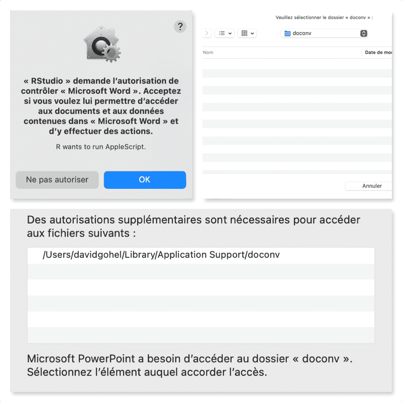

<!-- README.md is generated from README.Rmd. Please edit that file -->

```{r, include = FALSE}
knitr::opts_chunk$set(
  collapse = TRUE,
  comment = "#>",
  fig.path = "man/figures/README-",
  out.width = "100%"
)
library(doconv)
```

# doconv

 The tool offers a set of functions for converting 'Microsoft Word' or 
'Microsoft PowerPoint' documents to 'PDF' format and also for converting 
them to images in the form of thumbnails. In order to work, the package 
will use 'Microsoft Word', 'Microsoft PowerPoint', if they are not available 
program 'LibreOffice' can be used. A function is also provided to update 
 all fields and table of contents of a Word document using 'Microsoft Word'.

<!-- badges: start -->
[](https://github.com/ardata-fr/doconv/actions)
<!-- badges: end -->

## Installation

You can install the latest version from GitHub with:

``` r
# install.packages("devtools")
devtools::install_github("ardata-fr/doconv")
```

## Example

```{r}
library(doconv)
```

## Generate thumbails from file

You can generate thumbails as an image by using `to_miniature`:

```{r}
docx_file <- system.file(package = "doconv", "doc-examples/example.docx")
to_miniature(
  filename = docx_file, 
  row = c(1, 1, 2, 2))
```

It uses 'Microsoft Word' or 'Microsoft PowerPoint' program to convert Word or 
PowerPoint documents to PDF. If program 'Microsoft Word' or 'Microsoft PowerPoint'
is not available, it uses 'LibreOffice' to convert Word or PowerPoint documents to PDF.

Thus, this package can only be used when 'Microsoft Word' and 'Microsoft PowerPoint' 
programs are available or eventually 'LibreOffice'.

## Convert a PowerPoint file to PDF

```{r}
docx_file <- system.file(package = "doconv", "doc-examples/example.pptx")
to_pdf(docx_file, output = "pptx_example.pdf")
to_miniature("pptx_example.pdf", width = 1000)
```

## Convert a Word file to PDF

```{r}
to_pdf(docx_file, output = "docx_example.pdf")
```

```{r include=FALSE}
unlink(c("docx_example.pdf", "pptx_example.pdf") )
```

## Update Word fields and TOC

```{r eval=FALSE}
library(officer)
library(doconv)

read_docx() |> 
  body_add_fpar(
    value = fpar(
      run_word_field("DOCPROPERTY \"coco\" \\* MERGEFORMAT"))) |>
  set_doc_properties(coco = "test") |>
  print(target = "output.docx") |>
  docx_update()
```


## Setup

If not available on your machine and if possible, install 
'Microsoft Word' or 'Microsoft PowerPoint' programs.

If 'Microsoft Word' and 'Microsoft PowerPoint' can not be installed, 
install 'LibreOffice' on your machine; please visit 
https://www.libreoffice.org/ and follow the installation instructions.

Use function `check_libreoffice_export()` to check that the software 
is installed and can export to PDF:

```{r}
check_libreoffice_export()
```


If 'Microsoft Word' or 'Microsoft PowerPoint' are available on your machine, 
you can get images or pdf that looks exactly the same than the original document.
If not 'LibreOffice' is used to convert Word documents 
to PDF or as an image, in this case, be aware that 'LibreOffice' does not 
always render the document as 'Microsoft Word' would do (sections can be 
misunderstood for example).

### Authorization on macOS

If you are running R for 'macOS', you have to authorize few things before 
starting.

PDF processing will happen into a working
directory managed with function `working_directory()`.

Manual interventions are necessary to authorize 'Word' and
'PowerPoint' applications to write in a single directory: the working directory.

These permissions must be set manually, this is required by the macOS security
policy. We think that this is not a problem because it is unlikely that you will
use a Mac machine as a server.

User must manually click on few buttons:

1. allow R to run 'AppleScript' scripts that will control Word
2. allow Word to write to the working directory.



Don't worry, these are one-time operations.


## Related work

* Packages [docxtractr](https://CRAN.R-project.org/package=docxtractr) is providing 
`convert_to_pdf()` that works very well. The functionality integrated in Bob Rudis' 
package depends only on 'LibreOffice'. 

```{r include=FALSE}
# minimage::compress_images("man/figures", "man/figures", overwrite = TRUE)
```

