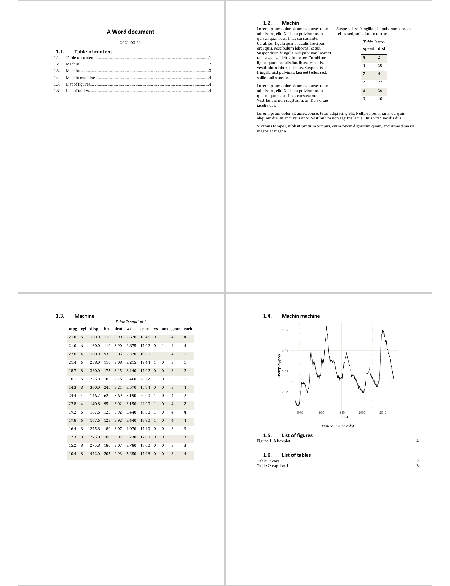
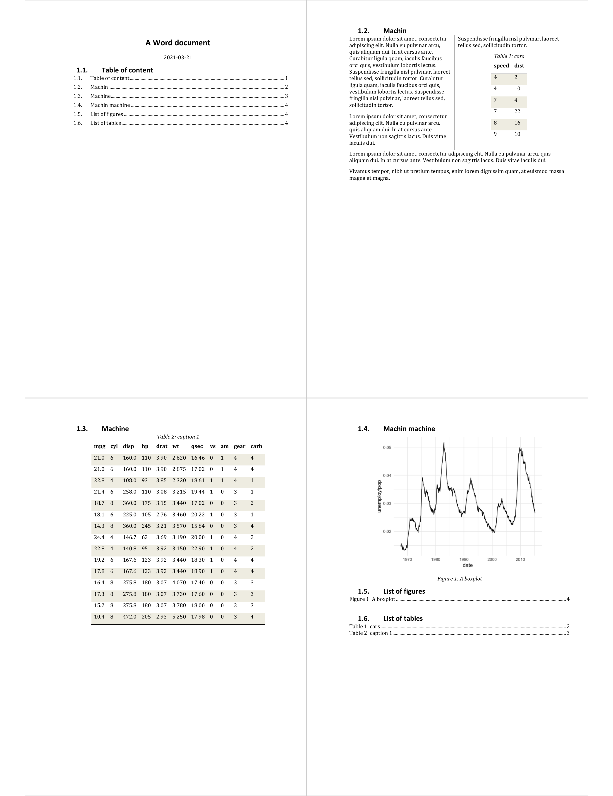

<!-- README.md is generated from README.Rmd. Please edit that file -->

# doconv

The tool offers a set of functions for converting ‘Microsoft Word’ or
‘Microsoft PowerPoint’ documents to ‘PDF’ format and also for
converting them to images in the form of thumbnails. In order to work,
‘LibreOffice’ must be installed on the machine and possibly ‘python’
and ‘Microsoft Word’.

<!-- badges: start -->

[](https://github.com/ardata-fr/doconv/actions)
[](https://www.tidyverse.org/lifecycle/#experimental)
<!-- badges: end -->

## Installation

You can install the latest version from GitHub with:

``` r
# install.packages("devtools")
devtools::install_github("ardata-fr/doconv")
```

You need R version `>= 4.0` to use this package.

## Example

``` r
library(doconv)
```

## Generate thumbails from file

You can generate thumbails as an image by using `to_miniature`:

``` r
docx_file <- system.file(package = "doconv", "doc-examples/example.docx")
to_miniature(
  filename = docx_file, 
  row = c(1, 1, 2, 2),
  use_docx2pdf = TRUE)
```



It uses ‘LibreOffice’ to convert Word or PowerPoint documents to PDF. It
probably works with other types of document but the package is only
focusing on PDF, Word and PowerPoint documents. If option
`use_docx2pdf=TRUE`, [docx2pdf](https://github.com/AlJohri/docx2pdf) is
used instead of ‘LibreOffice’ to convert Word files to PDF; you can only
use that option if ‘Word’ and ‘docx2pdf’ is installed on your machine.

## Convert a PowerPoint file to PDF

``` r
docx_file <- system.file(package = "doconv", "doc-examples/example.pptx")
to_pdf(docx_file, output = "pptx_example.pdf")
#> [1] "pptx_example.pdf"
to_miniature("pptx_example.pdf", width = 1000)
```



### Convert a Word file to PDF

``` r
to_pdf(docx_file, output = "docx_example.pdf")
#> [1] "docx_example.pdf"
```

## Setup

First ‘LibreOffice’ must be available on your machine, please visit
<https://www.libreoffice.org/> and follow the installation instructions.

> If ‘Microsoft Word’ is available on your machine, you can get images
> or pdf that looks exactly the same than the document rendered with
> ‘Microsoft Word’, if not ‘LibreOffice’ is used to convert Word
> documents to PDF or as an image, in this case, be aware that
> ‘LibreOffice’ does not always render the document as ‘Microsoft
> Word’ would do (sections can be misunderstood for example).

If ‘Microsoft Word’ is available on your machine, install python module
‘docx2pdf’ with the command `docx2pdf_install()` (and make sure
beforehand that python is available on your machine too):

``` r
library(locatexec)
library(doconv)
if(exec_available("python", error = TRUE) && # check that python is available
   !docx2pdf_available()){ # check that docx2pdf is available
  docx2pdf_install()
}
```

## docx2pdf and batch process

If docx2pdf process Word documents that contains TOC or any Word
computed field, the user will be invited to confirm the operation with a
Word pop-up that must be confirmed. That makes the process unreliable
when running in non-interactive mode.

**Then `docx2pdf` option should only be used in interactive mode when
Word is available.**

## Related work

  - Packages [docxtractr](https://CRAN.R-project.org/package=docxtractr)
    is providing `convert_to_pdf()` that works very well. The
    functionality integrated in Bob Rudis’ package depends only on
    ‘LibreOffice’.
